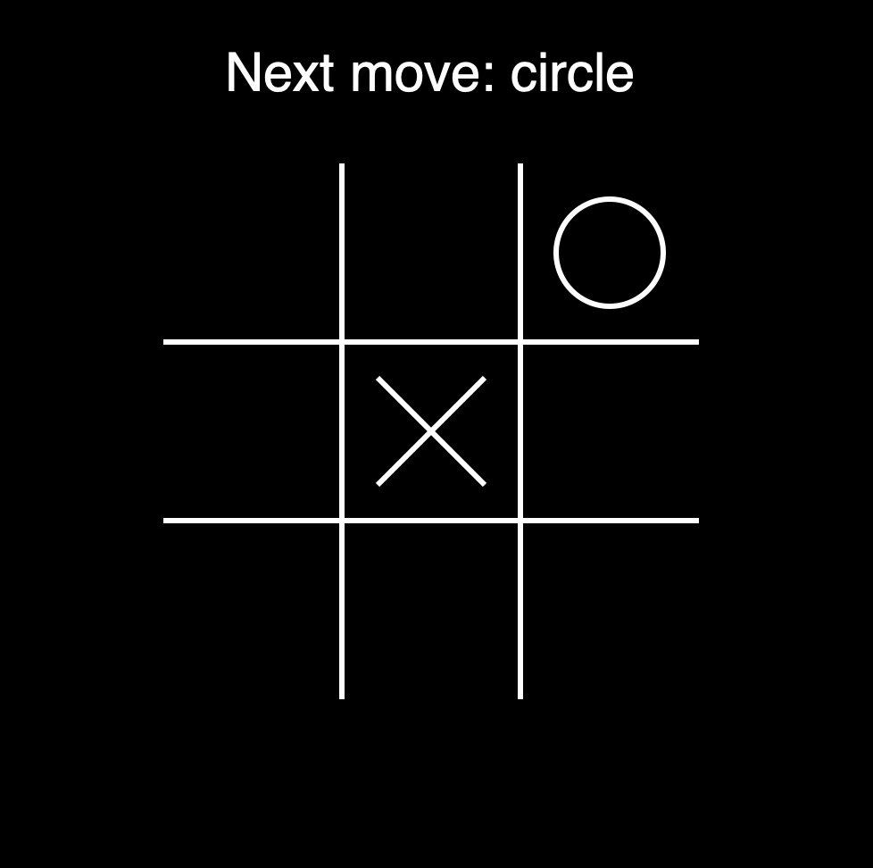

# Tic Tac Toe Game
This is a Tic Tac Toe Game for two players, which I created as part of a Python Bootcamp on Udemy. I expanded this project by making graphical interface out of graphics.py.

Rules are exactly the same as in a normal Tic Tac Toe Game. To place your marker - just click the field.

Screenshot from a game:

